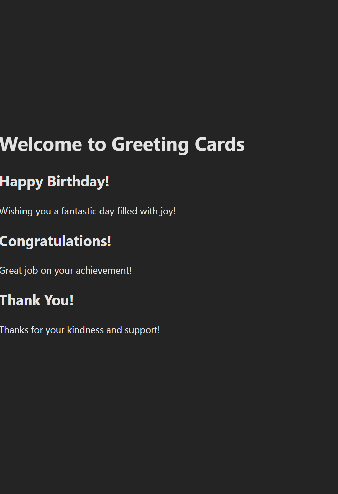

# React + Vite

This template provides a minimal setup to get React working in Vite with HMR and some ESLint rules.

Currently, two official plugins are available:

- [@vitejs/plugin-react](https://github.com/vitejs/vite-plugin-react/blob/main/packages/plugin-react/README.md) uses [Babel](https://babeljs.io/) for Fast Refresh
- [@vitejs/plugin-react-swc](https://github.com/vitejs/vite-plugin-react-swc) uses [SWC](https://swc.rs/) for Fast Refresh

# Project Overview:
The "Greeting Cards" project is a React app built using Vite and Tailwind CSS. It focuses on creating components, passing props, and styling the app using a utility-first CSS framework.

# Objectives:
- Create three components: "Header", "GreetingCard", and "main".
- Pass data (title and message) to "GreetingCard" via props.
- Style the app using "Tailwind CSS" for a responsive, modern look.

# Key Learnings:
- React Basics: Creating functional components and passing props.
- **Tailwind CSS**: Quickly styling components with utility classes.
- Vite: Setting up and using a fast development environment.
- **Problem-Solving**: Debugging import errors and styling issues.

This project helped me improve my skills in React, CSS, and modern web development tools.

# the final shot

# discussions
Working on the "Greeting Cards" project was both challenging and rewarding. While creating React components and using Tailwind CSS, I encountered issues with file imports and styling integration. These challenges tested my problem-solving skills but ultimately helped me gain a deeper understanding of React and modern web development tools like Vite. Although it wasn't easy, the project was a great learning experience that strengthened my skills.
